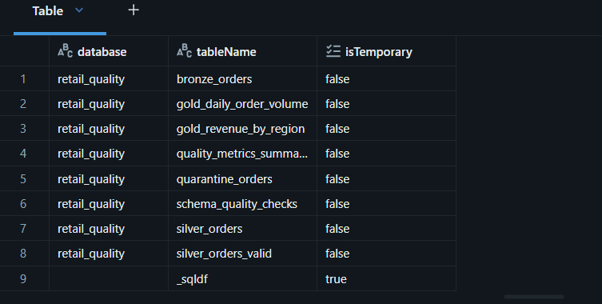
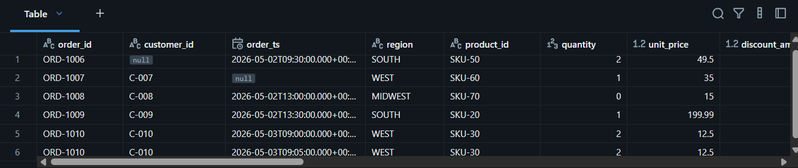
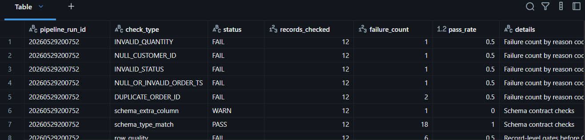
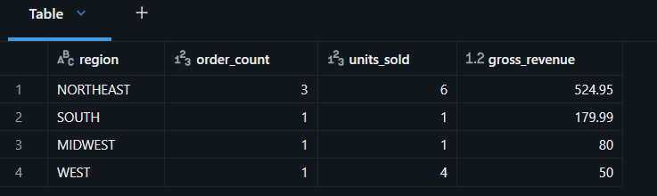
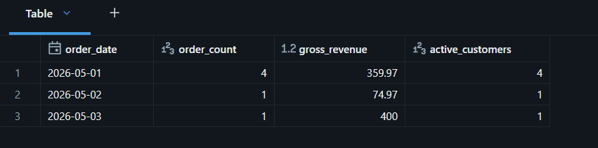

# Retail Order Quality Lakehouse

Databricks-ready medallion lakehouse project focused on data quality, governance,
and production readiness. It processes raw retail orders through Bronze, Silver,
quality gates, quarantine, and Gold analytics tables.

## Data Source

The included JSON files are small deterministic fixtures for repeatable local
testing. For a public retail dataset, use the UCI Machine Learning Repository's
Online Retail dataset and map its invoice fields into the order schema in
`order_quality/silver.py`: <https://archive.ics.uci.edu/dataset/352/online+retail>.

NYC TLC trip records are also a strong alternative public source if you want a
taxi version of the same quality framework: <https://www.nyc.gov/site/tlc/about/tlc-trip-record-data.page>.

## Architecture

```text
Retail order JSON
        |
        v
Bronze Delta
  - raw append-style order events
  - source file and ingestion metadata
        |
        v
Silver Delta
  - typed order schema
  - duplicate flagging
  - schema contract checks
        |
        v
Quality Gate
  - row-count reconciliation
  - null checks
  - invalid value checks
  - schema drift detection
  - duplicate detection
        |
        +--> Quarantine Delta table with reason_codes
        |
        v
Gold Delta
  - daily order volume
  - revenue by region
        |
        v
SQL analytics
```

## What This Demonstrates

- Bronze/Silver/Gold lakehouse design with Databricks Workflows orchestration.
- Row-level quality framework with null checks, invalid value checks, duplicate
  checks, schema validation, and schema drift detection.
- Quarantine table for failed records with auditable reason codes.
- Quality metrics summary table with pass rate, failure counts by check type,
  status, and metric date for trend analysis.
- Workflow dependency chaining and retry settings in `databricks/job.yml`.
- Gold business outputs for revenue by region and daily order volume.

## Quickstart

```bash
cd retail-order-quality-lakehouse
pip install -r requirements.txt
python -m order_quality.pipeline --input sample_data --warehouse lakehouse
pytest tests -v
```

The local runner writes Parquet so the project works without cloud credentials.
In Databricks, the same logic writes Delta tables through
`databricks/notebooks/order_quality_job.ipynb`.

## Output Tables

```text
lakehouse/
├── bronze/orders
├── silver/orders
├── silver/orders_valid
├── quarantine/orders
├── quality/metrics_summary
├── gold/daily_order_volume
└── gold/revenue_by_region
```

## Quarantine Reason Codes

| Code | Meaning |
| --- | --- |
| `NULL_ORDER_ID` | Missing order primary key |
| `NULL_CUSTOMER_ID` | Missing customer key |
| `NULL_OR_INVALID_ORDER_TS` | Missing or unparsable timestamp |
| `NULL_REGION` | Missing sales region |
| `NULL_PRODUCT_ID` | Missing product key |
| `NULL_QUANTITY` | Missing quantity |
| `NULL_UNIT_PRICE` | Missing price |
| `INVALID_QUANTITY` | Quantity is zero or negative |
| `INVALID_UNIT_PRICE` | Unit price is negative |
| `INVALID_DISCOUNT` | Discount is negative |
| `INVALID_STATUS` | Status is outside the allowed status set |
| `DUPLICATE_ORDER_ID` | Replayed or duplicate order identifier |

## Databricks Deployment

1. Create or use a Unity Catalog volume for raw files. This implementation uses:
   `/Volumes/workspace/default/retail_quality_raw/`.
2. Upload the sample JSON files into an `orders` folder under that volume:
   `/Volumes/workspace/default/retail_quality_raw/orders/*.json`.
3. Import this repo into a Databricks Git folder and open
   `databricks/notebooks/order_quality_job.ipynb`.
4. Run the notebook with these widget values:
   - `task`: `all`
   - `raw_path`: `/Volumes/workspace/default/retail_quality_raw`
   - `schema_name`: `retail_quality`
   - `pipeline_run_id`: any run id, or leave blank for an auto-generated value
5. Create tables with `sql/databricks_table_ddl.sql` if you want explicit DDL.
   The notebook can also create/overwrite the Delta tables through Spark writes.
6. Deploy `databricks/job.yml` as a Databricks Asset Bundle job, or recreate the
   same Bronze -> Silver -> Quality -> Gold task graph in Workflows.
7. Run the workflow and review:
   - `retail_quality.quarantine_orders`
   - `retail_quality.quality_metrics_summary`
   - `retail_quality.gold_revenue_by_region`
   - `retail_quality.gold_daily_order_volume`

Validation queries:

```sql
SHOW TABLES IN retail_quality;
SELECT * FROM retail_quality.quarantine_orders;
SELECT * FROM retail_quality.quality_metrics_summary;
SELECT * FROM retail_quality.gold_revenue_by_region;
SELECT * FROM retail_quality.gold_daily_order_volume;
```

## Databricks Run Evidence

### Tables Created



### Quarantine Orders



### Quality Metrics Summary



### Gold Daily Order Volume



### Workflow Success



## Resume Bullets

- Built a Databricks medallion lakehouse for retail orders with Bronze, Silver,
  Gold, quarantine, and quality metrics Delta tables.
- Implemented reusable data quality gates for row-count reconciliation, null
  checks, schema drift detection, duplicate flagging, and invalid business values.
- Designed a quarantine pattern that preserves failed records with reason codes
  before curated Gold publishing.
- Orchestrated the pipeline with Databricks Workflows dependency chaining,
  retries, and task-level notebook parameters.
- Published Gold SQL analytics for daily order volume and revenue by region.
